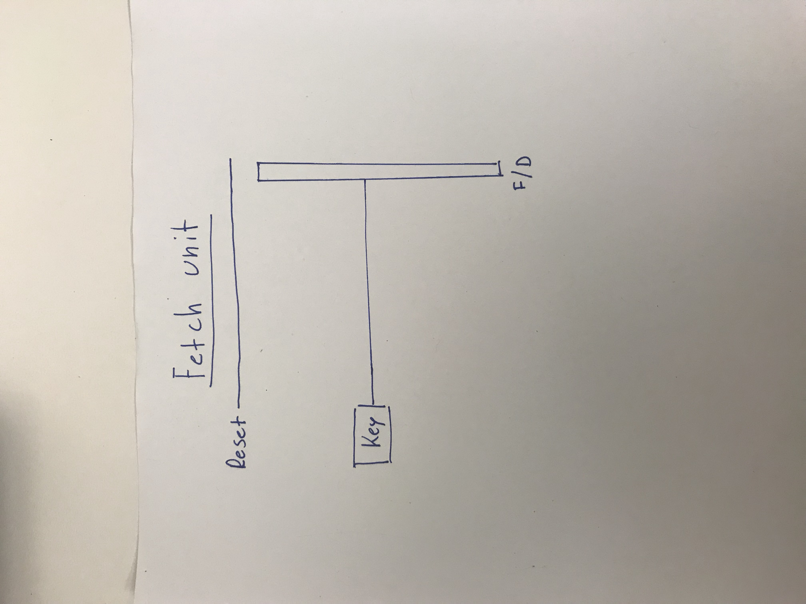
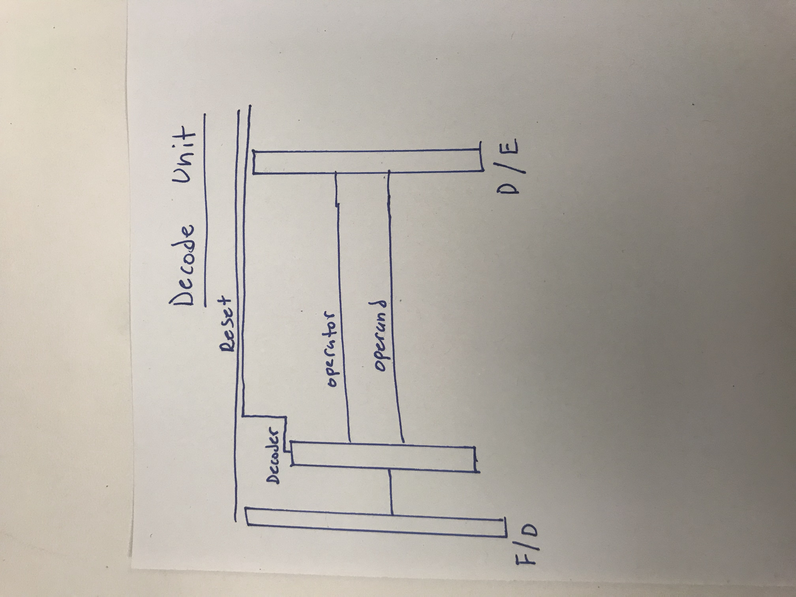
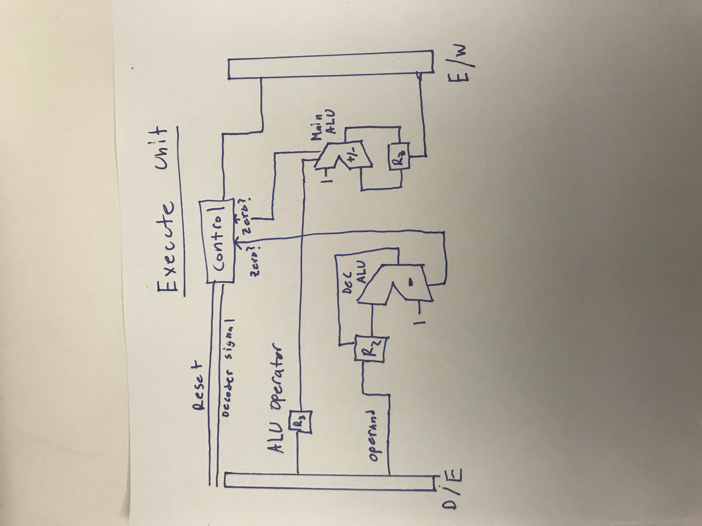
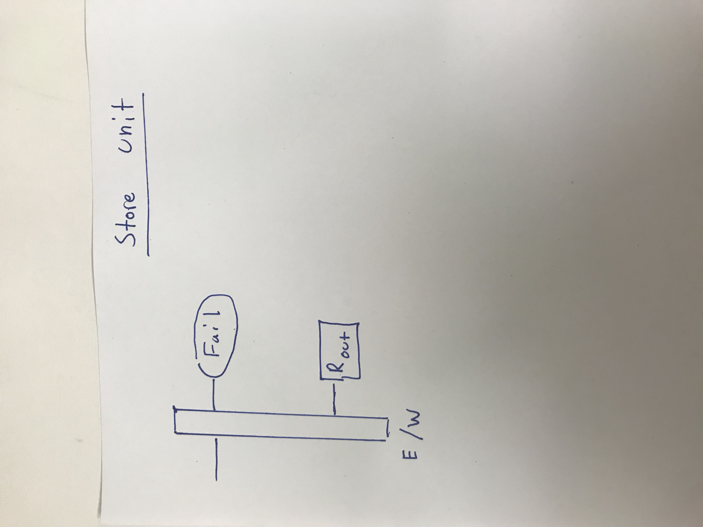

Final Report
============

Manuel Ponce
############

3.3 How the machine works::

    * Machine Must have an IN and OUT register with connections to the keyboard and display
    * The IN register will not be clock driven.
    * The machine does not take double digit integers.
    * The machine will only have an ADD and SUB key as long with keys with integers 0-9 on them. 
    * When the user presses ADD or SUB, the machine will either toggle the single digit adding machine or single digit subtracting machine.
    * Both adding and subtracting machine will decrement or increment driven by the ALU unit in a loop.
    * The machine does not give negative results

3.1 Testing the code

.. literalinclude:: Code/MajorTomsMachine/majorTomsCode.cpp
   :caption: Testing Major Toms Code

3.4.2 Fetch Unit

3.4.3 Decode Unit

3.4.4 Execute Unit

3.4.5 store Unit

3.6 Testing your design

.. literalinclude:: Code/MachineDesign/machineDesign.cpp
   :caption: Testing Machine Design Code

3.7 Design Review::

    I think one thing to add to the machine is a key validator. When decoding it finds if it's either an operator or an operand, but what if it's neither? Then twhat shouuld the machine do? It shoult let the control unit know and then trigger the correct register to be sent to the out Register to be shown for the user to know.

    Another thing this machine lacks is the ability to do mathematics (add/subb) in with negative integers. This would also have to do with the ALU and Execute satage to be able to do two's compliment with the integers to then be able to do the arithmatics.

